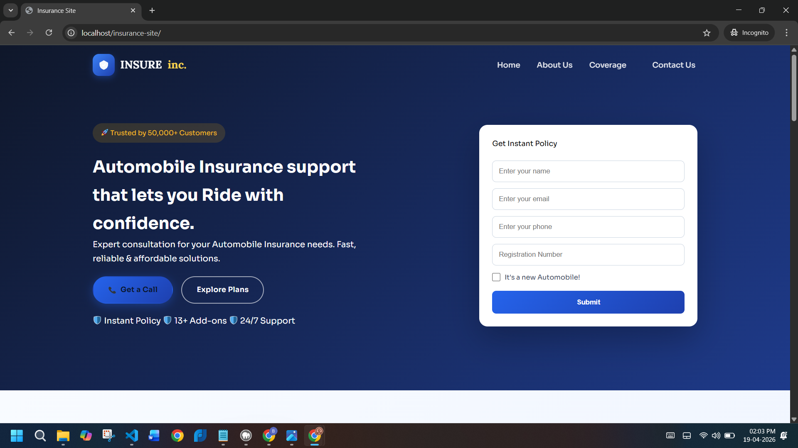
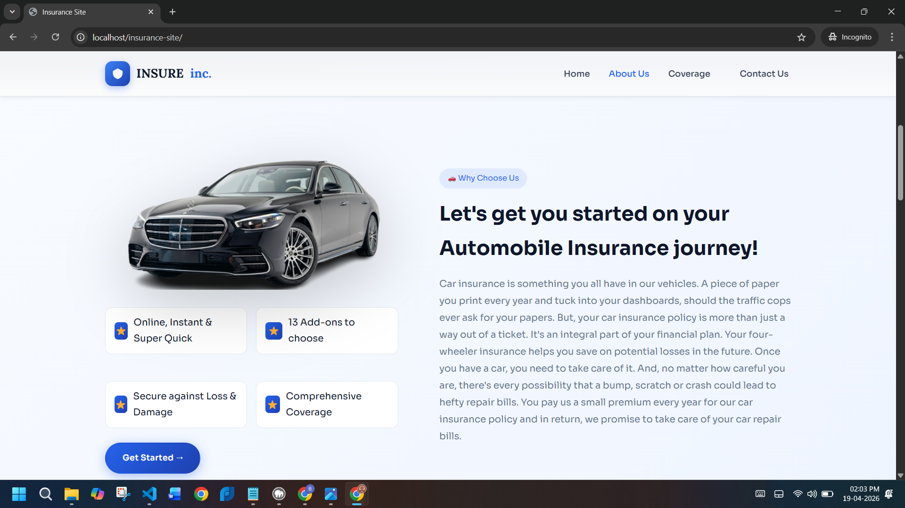
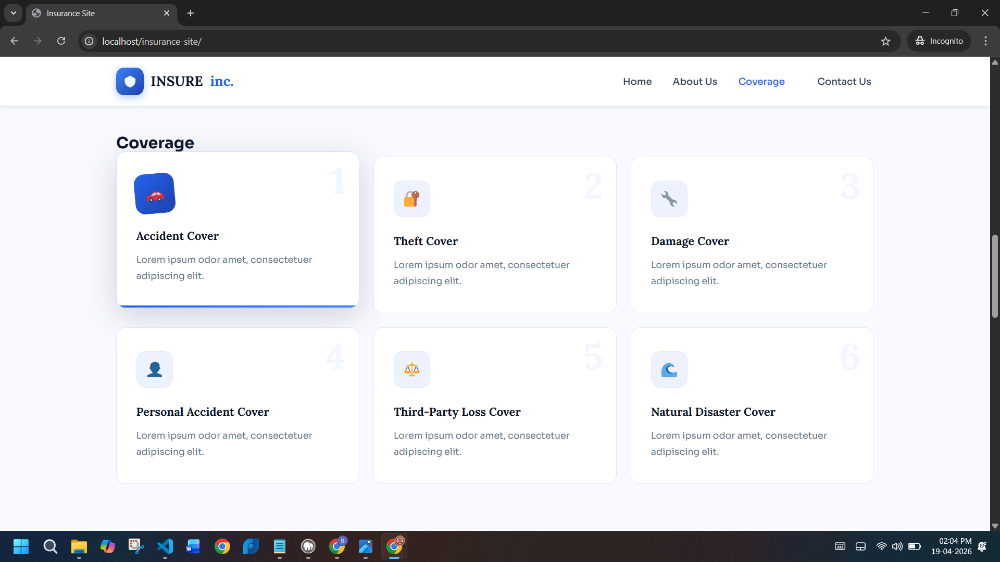
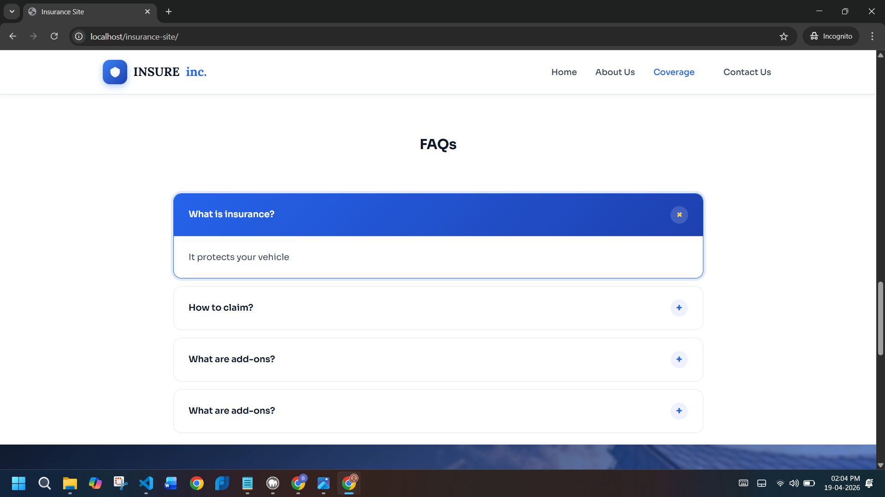
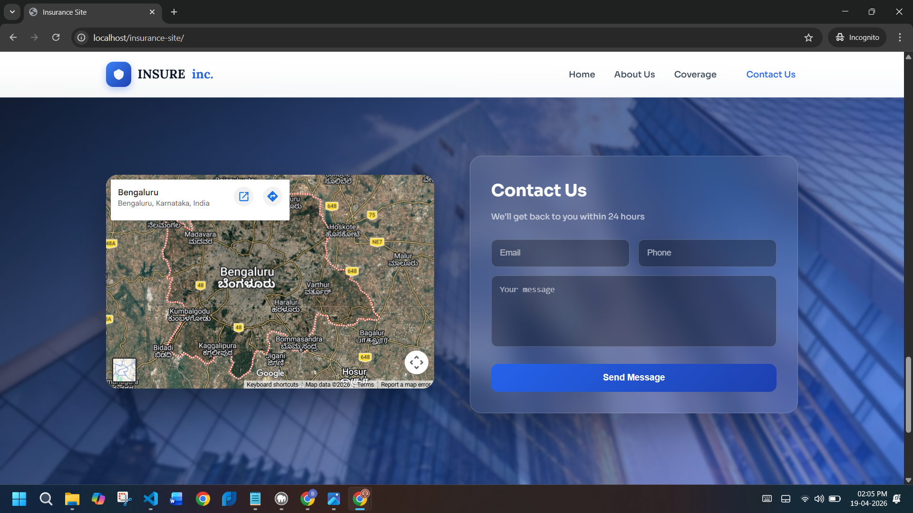
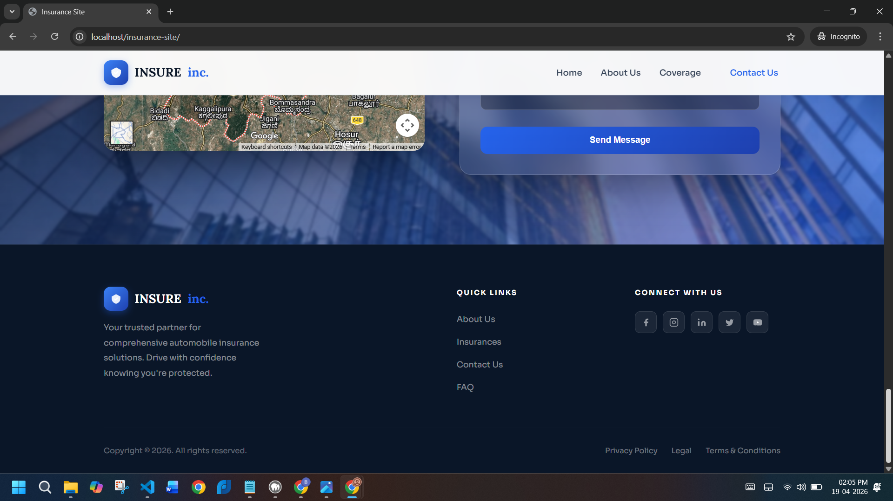

# Insure Inc, custom WordPress insurance landing page

A custom WordPress theme for an automobile insurance landing page. The project is designed as a clean multi-section website with a strong hero banner, trust signals, coverage highlights, FAQs, and a contact section with map integration.

## Project overview

This repository contains the cleaned source code for the **Insure Inc** website theme. The main focus of the project is the custom theme located in:

```text
wp-content/themes/insure-inc-theme-enhanced/
```

The website is built as a single-page style experience with navigation links that jump to the main sections of the page.

## What the website includes

- Hero section with a lead form for instant policy requests
- About section explaining the product value and support features
- Coverage cards for different insurance benefits
- FAQ accordion for common customer questions
- Contact section with embedded map and message form
- Footer with quick links, legal links, and social icons

## Screenshots

### 1. Home / Hero section
The landing section introduces the brand, highlights customer trust, and includes a lead capture form for requesting an instant insurance policy.



### 2. About section
This section explains why a user should choose the service. It combines a visual, short feature badges, and descriptive content about automobile insurance support.



### 3. Coverage section
The coverage area presents the major insurance benefits in a card layout, such as accident cover, theft cover, damage cover, and natural disaster cover.



### 4. FAQ section
The FAQ area is built as an accordion so visitors can expand and read common questions and answers without leaving the page.



### 5. Contact section
The contact area includes a map embed and a contact form, making it easy for users to reach the team and share their details.



### 6. Footer section
The footer contains branding, quick navigation links, social media icons, and legal links such as privacy policy and terms.



## Project structure

```text
insure-cleaned/
├── README.md
├── docs/
│   └── screenshots/
│       ├── home-hero.png
│       ├── about-section.png
│       ├── coverage-section.png
│       ├── faq-section.png
│       ├── contact-section.png
│       └── footer-section.png
└── wp-content/
    └── themes/
        └── insure-inc-theme-enhanced/
            ├── assets/
            │   ├── css/main.css
            │   ├── js/main.js
            │   └── images/car-placeholder.svg
            ├── footer.php
            ├── functions.php
            ├── header.php
            ├── index.php
            ├── page-home.php
            └── style.css
```

## Setup instructions

1. Install WordPress locally or on a server.
2. Copy the theme folder `wp-content/themes/insure-inc-theme-enhanced` into your WordPress installation.
3. Activate the theme from **Appearance > Themes**.
4. Create a page named **Home**.
5. Assign the **Home Page** template to that page.
6. Set the page as the static homepage from **Settings > Reading**.

## Notes

- This repository contains the cleaned theme-focused project, not a full WordPress production backup.
